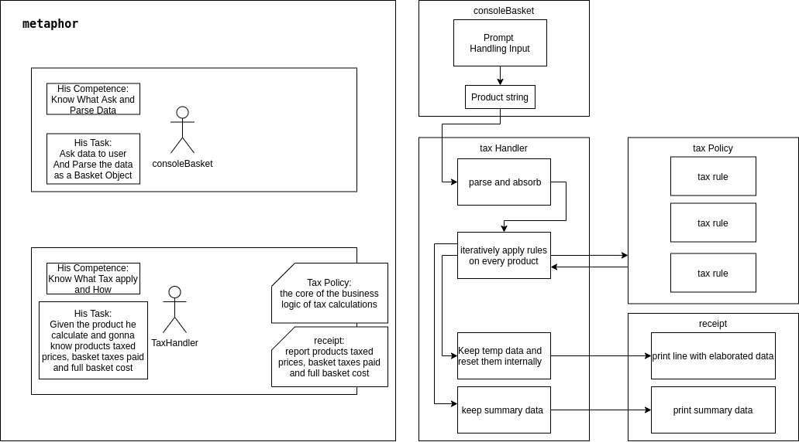

# xPeppers’ Sales Tax Interview Project 
So this week i felt a little more perfectionist than usual (burnout is youu?)

It’s a console application based on Nodejs,  
within an inquirer.js based basic user interface  
and  decimal.js calculations.

[HERE TO JUMP AT INSTALL AND RUN](#Requirements)  

It was the most focus and speed intensive challenge that i ever done until now.  
( joke for AppQualiy final examination Project i have the 50h awake record LOL)   
 
my Process:
- ***2 day relaxed sessions*** was about ***problem analysis*** and ***modeling***
- ***2 day moderate work sessions*** for ***learning on the fly*** nodeJS , 
  resume my javascript competence and mapping the pointers 
  to online knowledge about concepts that i knew only superficially before
- ***2 day long restless intensive coding session*** with short 4h snaps, caffeine 
  and discipline, the two things that was more ***struggling*** are Promise,events UI related 
  logic and the "float javascript bad thing" refactor discovered at 3th input ***testing***,
  they took me the pair of troubleshooting nights 
   
###Architecture

 
####Rules, standarts and design good practice 
i tried to keep in mind:
 
- Good Practice Mantra
    - Extensibility
    - Maintainability
    - KISS (Keep It Simple Stupid)
    - DRY ( Dont Repeat Yourself )
    - RTFM ( Read The Fucking Manual )
- Clean Code
    - Semantic code 
    - DX Developer Experience 
    - contained source files
    - JavaScript Standard Style
    - conventional commits and branches
- Design Principles:  
    - Abstraction               ( generalization )
    - Refinement                ( Problem decomposition ) 
    - Modularity                ( Single Responsibility Principle )
    - Software Architecture     ( reusable code )
    - Control Hierarchy         ( Defined Action Domain )
    - Structural Partitioning   ( Orthogonal Divisibility )
    - Data Structure            ( Clear Information Relationships )
    - Software Procedure        ( Single Component testability ) 
    - Information Hiding        ( Only Common Used Information accessibility )
---
## Requirements

For development, you will only need Node.js and a node global package

### Node
- #### Node installation on Windows

  Just go on [official Node.js website](https://nodejs.org/) and download the installer.
Also, be sure to have `git` available in your PATH, `npm` might need it (You can find git [here](https://git-scm.com/)).

- #### Node installation on Ubuntu

  You can install nodejs and npm easily with apt install, just run the following commands.

      $ sudo apt install nodejs
      $ sudo apt install npm

- #### Other Operating Systems
  You can find more information about the installation on the [official Node.js website](https://nodejs.org/) and the [official NPM website](https://npmjs.org/).

If the installation was successful, you should be able to run the following command.

    $ node --version
    v10.19.0
(version can be different)

If you need to update `npm`, you can make it using `npm`! Cool right? After running the following command, just open again the command line and be happy.

    $ npm install npm -g

## Install

    $ git clone https://github.com/MaksymSharinDev/xpeppers-sales-tax.git
    $ cd xpeppers-sales-tax
    

## Running the project

    $ node index.js

